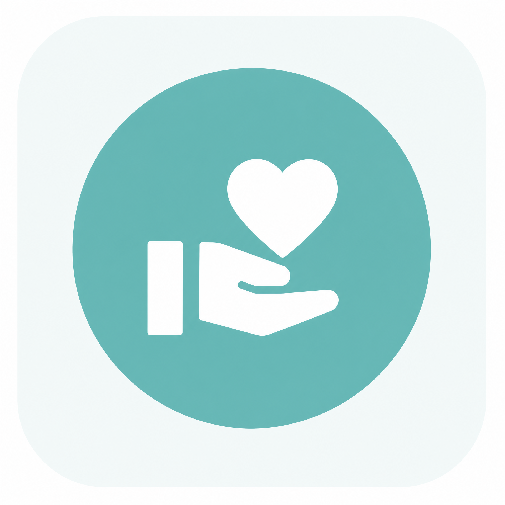
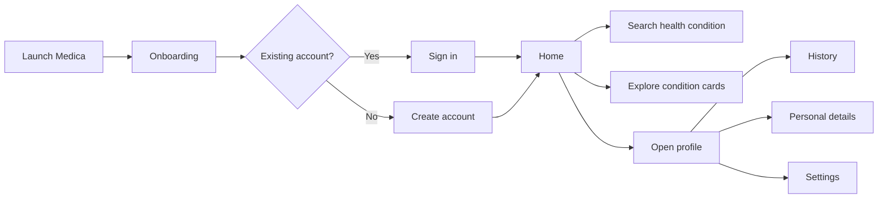

<div align="center">

# Medica

### Care that feels closer

A clean and approachable mobile healthcare experience for discovering health information, managing a patient profile, and keeping essential care journeys organized in one place.



[](https://github.com/Zeyad-GenAI/Medica)
[](https://github.com/Zeyad-GenAI/Medica)
[](https://github.com/Zeyad-GenAI/Medica)

</div>

> **Medica** is designed around a simple idea: healthcare should feel clear, organized, and only a tap away.

## Overview

Medica is a patient-focused mobile application concept with a calm, accessible interface for navigating everyday healthcare needs. The experience begins with a short onboarding journey, continues through account authentication, and leads into a home screen where users can search health conditions, explore care categories, and access their profile.

The interface uses a soft teal palette, high-contrast headings, rounded cards, and clear navigation patterns to make the application feel trustworthy and easy to use. The screens included in this repository document the current product direction and key user flows.

## Key Features

| Area | What Medica provides |
| --- | --- |
| Onboarding | Introduces the product through focused screens about accessible care and keeping the health journey organized. |
| Authentication | Supports sign-in and account creation flows with email and password fields, password visibility controls, and social sign-in entry points. |
| Form feedback | Demonstrates validation states for incomplete or invalid sign-in information so the user can understand what needs attention. |
| Health discovery | Provides a search entry point for health conditions and quick-access condition cards such as hypertension, diabetes, and osteoporosis. |
| Patient profile | Presents the patient account, profile photo editing, appointment history, personal details, and application settings. |
| Care organization | Positions appointments, prescriptions, reminders, and health information as parts of one connected care experience. |
| Navigation | Uses a persistent bottom navigation pattern for home, appointments/history, messages, and profile access. |

## User Flow



## Screenshots

### Onboarding

The onboarding sequence communicates the product promise, accessible care, and a more organized health journey.

| Splash screen | Health at a tap away |
| --- | --- |
|  |  |

| Organized care screen |
| --- |
|  |

### Authentication

The authentication screens show the sign-in and registration experience, including form states and account creation fields.

| Sign in | Create account |
| --- | --- |
|  |  |

| Validation state | Password entry state |
| --- | --- |
|  |  |

### Home and profile

| Home screen | Profile screen |
| --- | --- |
|  |  |

## Product Highlights

### A focused home experience

The home screen brings together a welcome message, health-condition search, a primary care call to action, condition categories, and a short health-focused guidance panel. This creates a clear starting point without overwhelming the user.

### A calm visual language

The visual system combines teal and mint accents with generous spacing, rounded surfaces, and readable typography. These choices support a healthcare-oriented product personality while keeping the interface friendly and modern.

### Profile-centered care management

The profile area gives the patient a single place to access history, personal information, settings, and profile-photo management. The structure is intentionally familiar so that common account actions remain easy to find.

## Suggested Technical Profile

The screenshots represent a mobile application UI targeting Android-sized devices. If this project is implemented with Flutter, the standard local workflow is shown below. The exact dependencies, package versions, services, and environment variables should always be taken from the repository source and configuration files.

| Layer | Role |
| --- | --- |
| Mobile client | Patient-facing healthcare interface and navigation flows. |
| Authentication | Email/password account access with optional social sign-in entry points. |
| Health content | Search and browse experience for conditions and care categories. |
| Profile | Patient identity, history, personal details, and settings. |
| Backend services | Add the project’s actual authentication, database, and API services here when enabled. |

## Getting Started

### Prerequisites

Install the mobile development toolchain required by the project. For a Flutter implementation, use the official Flutter installation guide and verify the local environment with `flutter doctor`.[1]

### Installation

```bash
git clone https://github.com/Zeyad-GenAI/Medica.git
cd Medica

# Flutter/Dart implementation
flutter pub get
```

### Run the application

```bash
flutter run
```

To launch on a specific connected device or emulator, first list available targets and then pass the selected device identifier:

```bash
flutter devices
flutter run -d <device-id>
```

### Build an Android release

```bash
flutter build apk --release
```

> **Note:** The public repository URL supplied for this README currently returns a GitHub 404 page, so the commands above are intentionally limited to the standard Flutter workflow suggested by the mobile UI. Confirm the project’s actual framework and scripts before publishing this section as final implementation documentation.

## Configuration

No secret values should be committed to the repository. If the application connects to external authentication, database, analytics, or healthcare services, document only variable names in an example file:

```env
# Example only — replace with the variables used by the project.
API_BASE_URL=
AUTH_CLIENT_ID=
AUTH_CLIENT_SECRET=
DATABASE_URL=
```

Keep real credentials in local environment configuration or a secure deployment secret manager. Do not place passwords, private keys, access tokens, or production patient data in source control.

## Project Structure

The following structure is a clean documentation template for a Flutter-based mobile application. Align it with the actual repository tree before using it as an implementation contract.

```text
Medica/
├── android/              # Android platform project
├── ios/                  # iOS platform project, if enabled
├── lib/                  # Application source code
│   ├── core/             # Shared theme, constants, and utilities
│   ├── features/         # Authentication, home, profile, and care flows
│   ├── models/           # Domain models
│   ├── services/         # API and authentication services
│   └── main.dart         # Application entry point
├── assets/               # Images, icons, and other bundled assets
├── test/                 # Automated tests
├── pubspec.yaml          # Dart/Flutter dependencies
└── README.md
```

## Privacy and Safety

Medica is a healthcare-oriented interface. A production release should treat personal and health-related information as sensitive data. Recommended safeguards include secure authentication, encrypted transport, strict access control, input validation, safe error messages, secure secret management, and a clear privacy policy. These items should be documented as implemented only after they are verified in the source code and deployment configuration.

> Medica is a software project and should not be presented as a substitute for professional medical advice, diagnosis, or emergency care.

## Roadmap

The following roadmap is a practical product direction based on the current screens rather than a claim about features already implemented:

- Connect authentication screens to a real identity provider.
- Add appointment discovery, booking, rescheduling, and cancellation.
- Add prescription and medication-reminder management.
- Add secure patient–provider messaging.
- Add richer health-condition pages with reviewed educational content.
- Add automated tests for authentication, navigation, validation, and profile flows.
- Add accessibility checks, localization, and production privacy documentation.

## Contributing

Contributions are welcome when they improve usability, accessibility, reliability, or documentation. Before opening a pull request, create a focused branch, explain the user or engineering problem being solved, test the affected flow, and include updated screenshots when the UI changes.

```bash
git checkout -b feature/your-change
git add .
git commit -m "Describe the change"
git push origin feature/your-change
```

Then open a pull request with a concise summary, implementation notes, testing evidence, and any follow-up work.

## License

No license file was visible from the supplied public repository link at the time this README was prepared. Add the project’s chosen license as `LICENSE` and replace this section with the appropriate notice before distributing the application.

## Author

**Zeyad ElFaramawy** — AI Engineer and Mobile App Developer

- GitHub: [@Zeyad-GenAI](https://github.com/Zeyad-GenAI)
- Portfolio: [zeyad-genai.github.io/portfolio](https://zeyad-genai.github.io/portfolio/)
- LinkedIn: [Zeyad El-Faramawy](https://www.linkedin.com/in/zeyad-el-faramawy-900547342/)
